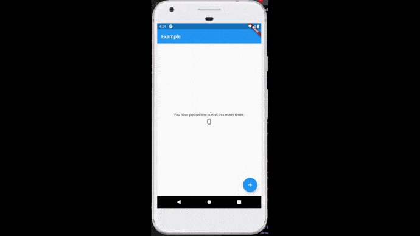

# android_t3_provider_bloc

Investigar de manera individual métodos para manejo de estados. (Explicación teórica y ejemplo práctico)
1.	Provider
2.	BLoC
3.	MobX (opcional)
4.	Redux (opcional)
5.	Inherited widget (opcional recomendado)

Seleccione como ejemplo para cada tipo la aplicación inicial que genera flutter, para poder observar las diferencias en el código de la aplicación al utilizarse para llegar al mismo objetivo final.

